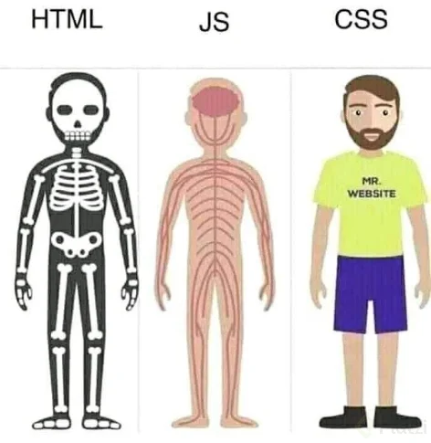

# Guia-Definitiva-HTML-CSS

Existen tres estándares importantes para generar productos web. Estos son los lenguajes o estándares que entiende todo navegador web:

* HTML
* CSS
* JavaScript

# HTML
Estructura de los documentos que se visualizan en los navegadores (Chrome, Edge, Firefox, Safari, Opera, entre otros). Es el lenguaje con el que clasificamos o etiquetamos cada parte del documento, dejándole saber al navegador qué información va a visualizar y qué valor tiene para nosotros. De esa manera, presentamos: Barras de Navegación, Secciones, artículos, listas, títulos de diferentes tamaños, audios, videos, imágenes, entre otros.

# CSS
Es el lenguaje con el que le damos estilos a todo el contenido previamente etiquetado con HTML. Es el encargado o usado para darle todo el aspecto visual de manera profesional, usando estándares de diseño de documentos y logrando así la correcta visualización de textos y recursos audiovisuales en formatos digitales o, en nuestro caso, las páginas web.

# JavaScript
Es lenguaje que se emplea para crear o brindar a las páginas web la capacidad de interactuar con el usuario y los recursos asociados a una página web, como lo son: bases de datos, servidores de diversa índole, información derivada de la interacción de cada página en sí.

# Diferencias entre HTML, CSS y JavaScript
HTML es la estructura, como si fuese el esqueleto de un ser humano o los cimientos de un edificio. Por ejemplo: una página web que funciona, pero sin interactividad, colores ni diseño.
CSS corresponde a lo estético, como la piel de ser humanos. La pintura y adornos de los edificios o la manera en que es posible que la estructura del html se vea mejor para los usuarios.
JavaScript equivale a los músculos, lo que da esa interactividad a las personas para moverse y realizar acciones como correr.



# ¿Qué es el Frontend?

Frontend es la parte de un programa o dispositivo a la que un usuario puede acceder directamente. Son todas las tecnologías de diseño y desarrollo web que corren en el navegador y que se encargan de la interactividad con los usuarios.

Un programador Frontend debe saber de código que entienda el navegador (HTML, CSS y JavaScript) para poder usar algunos frameworks o librerías que expanden sus capacidades para crear cualquier tipo de interfaces de usuarios. React, Redux, Angular, Bootstrap, Foundation, LESS, Sass, Stylus y PostCSS son algunos de ellos.

## Herramientas que maneja un frontend

Debido a que un frontend es el desarrollador (que puede ser o no Full Stack) que va a manejar las cosas del lado del cliente, las tecnologías con las que va a trabajar son:

* ```HTML```: https://devdocs.io/html/
* ```CSS```: https://devdocs.io/css/
* ```JavaScript```: https://devdocs.io/javascript/


### Frameworks de CSS para frontend:
* ```Bootstrap```: https://getbootstrap.com/
* ```Foundation CSS```: https://get.foundation/
* ```Materialize CSS```: https://materializecss.com/

### Los frameworks de JavaScript para frontend:

* ```React JS```: https://es.reactjs.org/
* ```Angular JS```: https://angular.io/
* ```Vue JS```: https://vuejs.org/

### Preprocesadores de CSS:
* ```Stylus```: https://stylus-lang.com/
* ```SASS```: https://sass-lang.com/

### Compiladores / empaquetadores de JS:
* ```BABEL```: https://babeljs.io/
* ```Webpack```: https://webpack.js.org/

# ¿Qué es Backend?

Backend en programación corresponde al lado opuesto a un Front-end en un sitio web o aplicación, ya que el Backend trabaja en el lado del servidor, mientras el Frontend lo hace en el lado del cliente. Es el responsable de manejar toda la lógica que existe detrás de una petición dada por el navegador hacia el servidor. Existen programadores que manejan ambas especialidades y se les conoce como full stack

Una característica que lo diferencia del Frontend es que no tiene estándares, puesto que tiene varios lenguajes de programación (Node.js, Python, PHP, Ruby, GO, Java, .NET entre otros) con los que debe trabajar. Cada uno de estos lenguajes tiene sus propios frameworks como:

* Django (Python)
* Lavarel (PHP)
* Rails (Ruby)
* Express (JavaScript)
* Spring (Java)

El Backend también tiene en cuenta la infraestructura donde va a realizarse el deploy de su aplicación (esto también puede ser tarea de un DevOps, un perfil dedicado a la infraestructura), con tecnologías como:

* Google Cloud
* DigitalOcean
* AWS
* Heroku, entre otras.

### ¿Qué es deploy?

Deploy es un término famoso entre los desarrolladores web. Puede significar muchas cosas, dependiendo del ambiente y de la tecnología usada. Sin embargo, los significados que más se refieren a la práctica y pueden resumir su función son: implantar, colocar en posición, habilitar para uso o, simplemente, publicar.

Por último, entramos en bases de datos, que son las encargadas de almacenar toda la información del proyecto. Los principales tipos son:

* Bases de datos relacionales (como MySQL)
* Bases de datos no relacionales (como mongoDB).